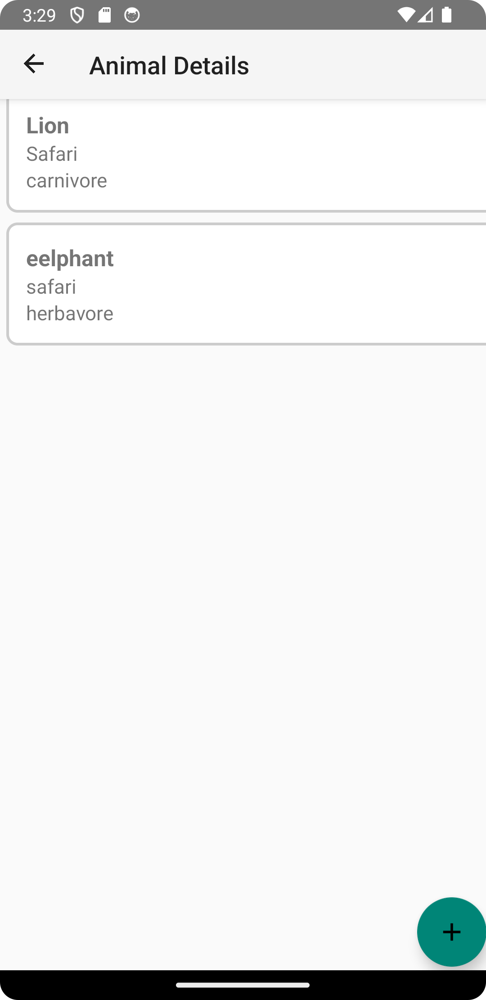
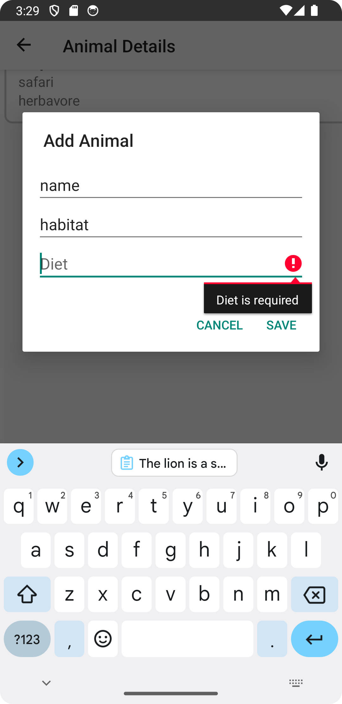
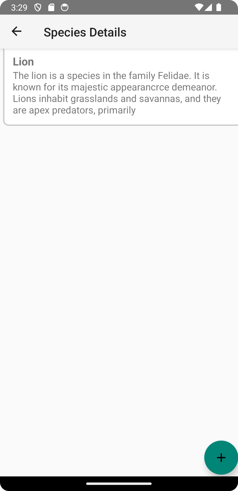
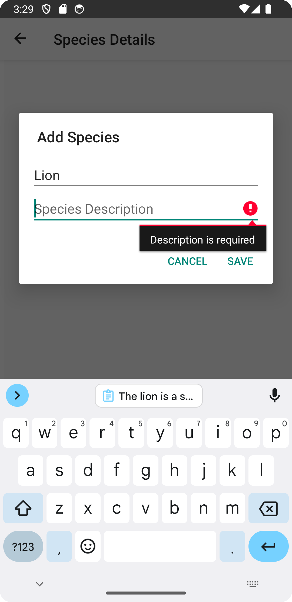

# Mobile Device Programming
Assignments are in their separate folders. See screenshots below.

## Assignment 7 - Animal Kingdom Explorer

The Animal Kingdom Explorer app is an Android application designed to allow users to explore and manage information about animals and species.

## Overview
The Animal Kingdom Explorer app utilizes modern Android development techniques and architecture components to provide a seamless user experience. Key components include:

- Room Database: For data persistence, allowing seamless storage and retrieval of information about animals and species.
- Navigation Component: Facilitates navigation between different fragments within the application.
- ViewModel and LiveData: Manages UI-related data and ensures data consistency across the application.
- Coroutines: Used for asynchronous operations, enhancing app responsiveness.

## Screenshots

## Instructions

Adding Animals:
- Go to Animal Details
- Look for the "+" button and tap it.
- Fill in the name, habitat, and diet.
- Make sure all fields are filled.
- Tap "Save" to add the animal.

Adding Species:
- Go to Species Details
- Look for the "+" button and tap it.
- Fill in the name and description.
- Make sure all fields are filled.
- Tap "Save" to add the animal.

## Demo

https://youtu.be/khYSIadlN0w
